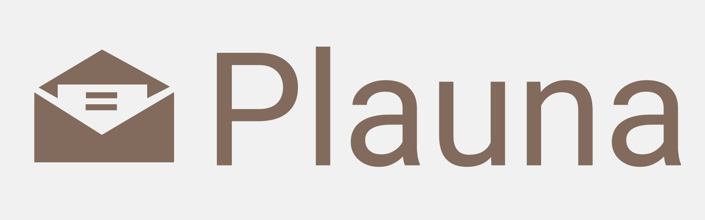

#+OPTIONS: ^:nil

#+CAPTION: Plauna Banner

[[https://coveralls.io/github/ozangulle/plauna?branch=fix/connections][file:https://coveralls.io/repos/github/ozangulle/plauna/badge.svg?branch=fix/connections]] [[https://web.libera.chat/#plauna][file:https://img.shields.io/badge/chat-Libera.Chat-blue.svg?logo=irc]]

*Organize your e-mails without sacrificing your privacy*

Plauna is a privacy focused service that helps you categorize your e-mails. All of its data is stored only on your computer.

You can parse your e-mails from mbox files or directly by connecting to your IMAP servers. Plauna helps you categorize your e-mails and automates the process so that incoming e-mails are moved to their respective folders on your IMAP server.

*IMPORTANT:* Plauna is still under heavy development at the moment. The features are subject to change.

* Features

- You own 100% of your data. Everything is on your machine.

- You define your categories: Use as many or few as you like

- Multi-language support.

- Support for multiple IMAP connections.

- Statistics about your emails and metadata (very basic, still under development).

- Upload data from mbox archives.

- Read emails directly from IMAP folders.

* Current Changes

Plauna has recently introduced a new UI. Furthermore, work is underway to improve the categorization process. Efforts are focused on making the transition from the old workflow to the new one as smooth as possible. If you encounter any bugs or believe these changes have invalidated your workflow, please open a bug ticket.

* What Plauna is NOT

Plauna is not an e-mail archive tool. It only saves headers and contents from e-mail that it thinks will be useful for categorizing your e-mails. Certain things like the attachments are explicitly not stored in order to save db space. Please do no rely on Plauna to successfully preserve the e-mails you want to archive. 

* How to get Plauna

** Docker

The easiest way to get Plauna is using the [[https://hub.docker.com/r/ozangulle/plauna][Docker image]].

Plauna requires some configuration to work as mention under "How to use" -> "How to run" below. If you're going to use docker, it makes sense to mount the configuration file in a separate volume.

** Build from source
The second way to get Plauna is fetching it from the git repository and compiling the backend and the front ends using Clojure CLI with the commands:

#+begin_src
  clojure -M:cljs release app    # for the frontend
  clj -T:build uber              # for the backend
#+end_src

It is important to run the frontend build first, as it creates the artifacts for the UI which are then packaged with the second command. This latter command produces a Plauna uberjar in the ./target directory which you can run using a Java Runtime Environment like this:

#+begin_src
  java -jar target/plauna-standalone.jar
#+end_src

* How to use

** Configuration

There are two configuration values which cannot be configured from withing Plauna. These are:

The database folder - this is where the database file (SQLITE) and the training files live. Defaults to /var/lib/plauna
The server port - Defaults to 8080

Note: If you run Plauna as a Docker container, the directory /var/lib/plauna is created automatically. If you want to run it on your computer as a jar file, you must create this directory yourself.

*** Environment Variables

You can use the environment variables $DATA_FOLDER and $SERVER_PORT

*** CLI Parameters

You can also configure these values using the cli parameters --data-folder, and --server-port.

E.g. java -jar plauna.jar --server-port 80

*** Order of Priority

In case multiple values are provided, plauna decides on which value to use according to the priority list below:

1. CLI parameters
2. Environment variables
3. Default configuration

** Authentication

Plauna supports basic (username - password) and oauth2 (XOAUTH2) authentication methods.

**** Basic Authentication

Basic authentication is very straightforward. Leave "Authentication" at "Basic" (it is the default value), enter your username and password. You will need to click at "Connect" on the "Connections" page in order to connect to the server. This is only needed during the initial set up. Plauna automatically tries to connect to every configured e-mail server on startup.

**** Oauth2

Currently only tested for Gmail!

Prerequisites: You need your own application on Google Cloud, or Azure, or whatever e-mail provider you are using.

When you select "Oauth2" on the connection screen, a new section called "Auth Providers" will appear underneath the connection details. You need to fill in a name (only for displaying on Plauna, you can choose whatever you like), the authentication and the token urls of your oauth provider, the client id and secret of your application, the scopes (separated with an empty space), and a redirect url. The redirect url path is "/oauth2/callback". If you're testing on localhost, you need to enter http:///localhost:{port}/oauth2/callback. If you are using a custom domain for Plauna, please adjust accordingly.

After saving the auth provider, you need to select it under connection config and click "update connection". You can leave the "Secret" field in the "Connection Config" form empty. It will not be used for oauth2.

After you set up your configuration, go to the "Connections" page and click on "Connect". On your first login, you will be redirected to your oauth provider in order to authorize the application you created to access your data. If everything is set up correctly, you will then be redirected automatically back to Plauna.

** Getting Started

When you start Plauna, it starts a web server on the port which you specified (defaults to 8080). Here are the steps you need to follow in order to set it up.

*** Create Categories

Go to "Admin" -> "Categories" in order to create and delete categories. You can theoretically create as many categories as you want but usually less is more. Start simple. Two to three categories are often more effective than many.

Common examples: "Important" and "Not Important", or "Newsletters", "Work", and "Personal".

The most important thing is to take your time and think about what you want to achieve.

*** IMAP Connection 

IMAP Connections are listed under the "Connections" tab. Here you can create, edit, and delete IMAP connections.

After creating a connection for the first time, you need to connect to it under the "Connections" overview page.

After a successful connection, click on the connection you want to manage. You will see the categories you created in the previous step.

Map each category to an IMAP folder — assign the folder where you want emails in that category to be stored (e.g., map "Newsletters" category to your Newsletters folder).

After assigning all folders, you will need to reconnect.

After this step, Plauna monitors your Inbox for incoming emails and watches your category folders for emails to learn from.

*** Initial Categorization

At this point, Plauna knows about your desired categories and your IMAP setup but its own database is empty. You need to populate the database with emails before you can start training Plauna to automatically categorize your emails. There are three ways of populating the database:

1. Move relevant emails to the folder you specified: If you have a category folder for newsletters, move at least a 50-60 emails to this folder.

2. Go to the "Connections" tab, click on any IMAP account name, select a folder you want to parse the e-mails in, make sure "Move e-mails after categorization" is unchecked, select which category should be assigned to these emails and click on the button "Parse E-mails". This will read all the e-mails in the selected folder and assign them to the corresponding category. You can also leave the category empty and then manually assign the categories through Plauna's interface.

3. Let Plauna run and automatically save incoming emails as you manually sort them. Depending on how many e-mails you receive on any given day, this method may be very slow.

   
*** Languages

Plauna is designed for multilingualism in mind and automatically detects the language of an e-mail upon parsing it. There is a possibility that you do not want to automatically categorize for every language you have. Plauna does not make any assumptions for you. This is why you need to go to "Administration" and check the languages that are relevant for your data training.

*** Data Training

After you have at least roughly 50 emails in every category per language, you can click on the button "Traing Using Existing Data" button where your emails are listed.
*Important:* You must have more than one category saved for each language you want to train in.

*** Automatic Categorization

After training your models on the categories you created, Plauna will categorize each e-mail you receive and moved it automatically to its corresponding folder.

* Security

Plauna comes without security features like different users. It is made to be used by self-hosters who own and use the service themselves in an internal network that is isolated.

*Please do not use Plauna in an open network or open ports to outside!*
